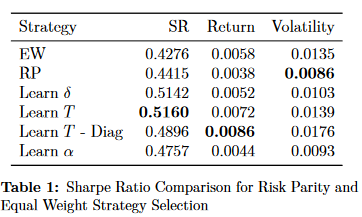
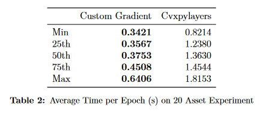
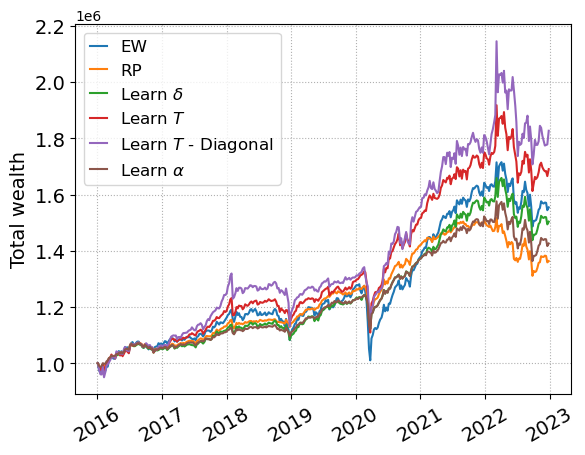

# Distributionally Robust Risk Parity Portfolios

We develop a distributionally robust risk parity (DRRP-W) formulation using the Wasserstein distance. This program, unlike existing DRRP programs, can be cast as a convex minimization program rather than a minimax program and demonstrates computational advantages over the existing state of the art. We use recent advances in end to end learning and differentiable convex optimization layers to dynamically learn the optimal size of the uncertainty set to maximize the out of sample sharpe ratio. A custom PyTorch layer is provided which significantly reduces computational cost. Experiments illustrate the effectiveness of the strategy and potential areas of improvement. A second focus of this paper is in the optimal learning of the structure of regularization for portfolio optimization problems. We generalize the norm in  DRRP-W to a matrix and learn the entries which maximize the out of sample sharpe ratios. Computational experiments show that the added flexibility from this yields superior financial performance. Lastly, we propose a rolling hyperparameter optimization structure based on batching for end-to-end learning which exactly replicates the rebalancing process for investors.

# Main Results

Sharpe Ratio Performance             |  Speed Benefit Using Custom Gradient
:-------------------------:|:-------------------------:
  | 

### Wealth Evolution

